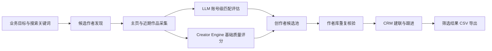
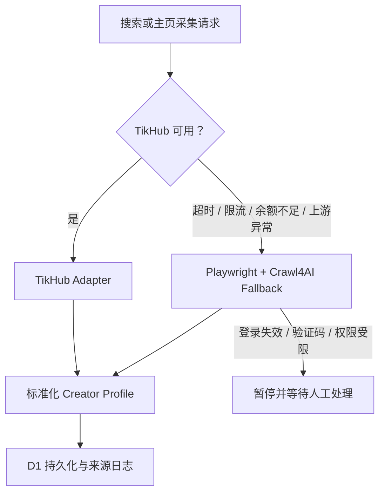

# Creator Radar · AI 创作者发现与运营工作台

> 从业务目标出发，完成创作者发现、账号级 AI 评估、重复核验、CRM 跟进与结果导出的端到端作品。


Creator Radar 是一套面向内容平台创作者引入场景的 AI 工作台。运营人员输入搜索关键词和本次引进标准，系统从公开内容中发现候选作者，结合主页与近期作品进行账号级评估，再经过重复核验进入 CRM，最终导出可执行的 BD 名单。

这个项目重点解决的不是“找到包含某个关键词的视频”，而是回答一个更接近真实运营的问题：

> 这个账号整体是否持续符合本次业务目标，并且值得进入下一步建联？

## 项目亮点

- **目标驱动发现**：搜索关键词负责发现候选，筛选标准负责判断价值，两者相互独立。
- **账号级 LLM Evaluation**：综合主页定位和近期作品集合，避免被偶然命中的单条内容误导。
- **双层评分体系**：LLM 判断当前业务匹配度；Creator Engine 独立衡量资料完整度、活跃证据与基础质量。
- **可恢复任务执行**：支持暂停、继续、检查点、单账号失败隔离和失败重试，不因单点异常丢失整个任务。
- **多数据源降级**：TikHub 异常时可切换独立 Playwright/Crawl4AI 采集服务，并保留数据来源与失败原因。
- **证据约束推荐**：证据不足时自动限制分数和置信度，不把“没有采集到”误判为“没有风险”。
- **运营闭环**：候选池、重复核验、CRM 阶段管理、跟进记录和 CSV 导出连接成一条工作流。
- **成本意识**：主页缓存、有限作品采样、请求量预估、低成本接口优先和失败退避共同控制 API 消耗。

## 产品工作流



## 核心界面

| 模块 | 解决的问题 |
| --- | --- |
| 工作概览 | 汇总已发现作者、重复情况与可建联候选 |
| 搜索任务 | 创建、暂停、继续、删除任务，并查看实时进度与成功作者 |
| 创作者候选池 | 按昵称、内容类目、推荐状态、重复状态和新锐标签组合筛选 |
| 作者详情 | 查看账号证据、代表作品、AI 结论、风险与建议动作 |
| 运行日志 | 追踪数据源、采集阶段、降级、警告和失败原因 |
| CRM | 管理负责人、建联阶段、联系方式、跟进时间、备注与历史事件 |

系统支持游戏、动漫、母婴育儿、宠物、生活、三农、历史、科学、财经、艺术、时尚、文化、家居、科技、摄影、房产等内容类目，也允许根据新的业务目标扩展分类。

## LLM Evaluation V2

评估器不评价创作者的“绝对好坏”，只判断账号整体是否符合当前筛选目标。

### 证据优先级

1. 主页定位与近期作品集合；
2. 搜索命中的作品；
3. 评论等弱辅助信号。

当主页长期方向与单条命中内容冲突时，以主页和近期作品集合为准。模型同时识别偶然命中、内容漂移、搬运切片、强营销、模板化内容和疑似低质量 AI 内容。

### 评分解释

| 分数 | 运营建议 |
| --- | --- |
| 0–39 | 当前目标匹配度低，暂不引入 |
| 40–59 | 弱相关或证据不足，进入人工判断 |
| 60–79 | 较匹配，补采证据或持续观察 |
| 80–100 | 账号级证据相互印证，可优先联系 |

只有同时取得主页简介和至少 3 条近期作品，且置信度达到要求，账号才可能进入高优先级推荐。评估结果包含主/次类目、创作者类型、匹配理由、风险、建议动作以及目标匹配、账号一致性、原创性、内容价值和活跃证据五项维度。

## 数据源与容错设计



备用采集服务不是验证码或权限绕过工具。登录失效、出现验证码或访问权限不足时，任务会安全暂停并记录原因，等待人工恢复。系统不会保存平台账号密码。

## 技术架构

| 层级 | 实现 |
| --- | --- |
| Web 工作台 | React 19、TypeScript、Next.js App Router / Vinext |
| 服务端与任务 API | Cloudflare Workers |
| 数据持久化 | Cloudflare D1、Drizzle ORM |
| 主数据源 | TikHub Adapter |
| 备用数据源 | Python、Playwright、Crawl4AI |
| 智能评估 | OpenAI-compatible LLM API、结构化 JSON 输出 |
| 质量引擎 | 平台无关 Creator Engine、Shadow Evaluation |
| 测试 | Node Test Runner、服务端渲染与 Adapter 单元测试 |

```text
app/                    Web 工作台与 API
db/                     D1 数据访问与 Schema
drizzle/                数据库迁移
lib/adapters/           TikHub、Playwright 与备用服务适配器
lib/creator-engine/     标准化、基础评分与旁路评估
lib/services/           LLM Evaluation 与业务规则
worker/                 后台任务执行、恢复与日志
fallback_crawler/       Python/Playwright/Crawl4AI 备用服务
tests/                  核心规则与数据源测试
```

## 本地体验

### 1. 环境要求

- Node.js 22.13+
- pnpm
- Python 3.11+（仅在启用备用采集服务时需要）

### 2. 启动 Web 工作台

```bash
pnpm install
cp .env.example .env
pnpm dev
```

访问 `http://localhost:3000`。默认可使用 Mock 模式体验完整界面；Mock 数据与 Live 数据严格隔离，不会混入正式任务结果。

### 3. 启用真实服务

在本地 `.env` 中配置所需服务。请勿将密钥提交到 GitHub。

```dotenv
APP_MODE=live
AI_PROVIDER=openai
TIKHUB_API_KEY=your_tikhub_key
LLM_API_KEY=your_llm_key
LLM_BASE_URL=https://api.openai.com/v1
LLM_MODEL=gpt-4.1-mini
```

若需要启用备用采集服务，请参考 [`fallback_crawler/README.md`](fallback_crawler/README.md)。浏览器登录状态、虚拟环境、运行缓存和本地数据均被 Git 忽略，需要在每台设备上单独配置。

## 验证

```bash
pnpm typecheck
pnpm lint
pnpm test
```

测试覆盖 Creator Engine、LLM 证据约束、昵称精确匹配、TikHub 错误分类、备用数据源鉴权与服务端渲染。

## 设计取舍

- **准确性优先于虚假自动化**：无法确认的账号进入人工复核，不强行给出确定结论。
- **公开证据优先**：不推测未提供的身份属性，也不将粉丝数直接等同于合作价值。
- **人工在环**：重复核验、验证码与权限异常保留明确人工处理节点。
- **可解释而非只有总分**：每个推荐均保留匹配理由、风险、证据等级与下一步动作。
- **渐进式真实接入**：Mock 用于演示与测试，Live 只展示实际采集并成功持久化的数据。

## 安全与合规边界

- 仅处理业务有权访问的公开信息或授权数据；
- 不保存抖音、百度或其他平台的账号密码；
- 不绕过验证码、登录校验或访问权限；
- 不自动采集受限的内部作者库；
- 外部作者库查重默认采用精确昵称和人工确认，避免同名误判；
- `.env`、数据库、浏览器 Profile、日志和本地缓存不会提交到仓库。

## 项目状态

当前版本已完成可运行的端到端产品闭环，适合作为创作者发现、AI 业务评估、可恢复任务和运营 CRM 的工程案例展示。真实生产使用仍需要由部署方配置合规数据源、Cloudflare D1、LLM 服务与对应平台权限，并通过小样本人工校准评估标准。

---

如果这个项目对你有启发，欢迎通过 Issue 交流产品设计、数据采集容错、LLM Evaluation 或创作者运营工作流。
